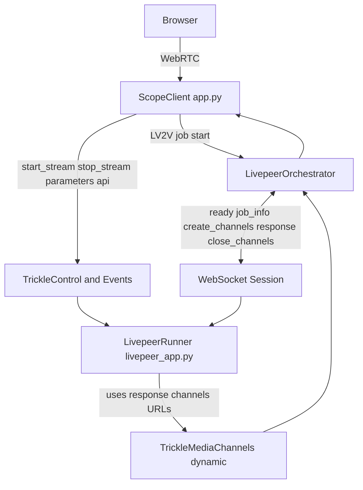

# Livepeer Architecture

This document describes the architecture, WebSocket protocol, and control message format for the Livepeer integration. For setup instructions, see [How to Start Livepeer Mode](../livepeer.md).

## System Overview

Scope's Livepeer mode delegates inference to a remote runner via the Livepeer network. The Scope client acts as the LV2V (live-video-to-video) client, the orchestrator manages trickle media channels, and the runner processes frames.



### Component Roles

- **Scope client** (`app.py`) — Acts as the LV2V client. Calls `start_lv2v()`, sends control messages (`start_stream`, `stop_stream`, `parameters`, `api`) over trickle channels, and relays browser media.
- **Runner** (`livepeer_app.py`) — A standalone FastAPI WebSocket server. Receives the LV2V job response forwarded by the orchestrator, subscribes to control and events channels, processes frames using Scope's `FrameProcessor`, and proxies API requests into the embedded Scope FastAPI app.
- **Orchestrator** — Creates and closes trickle media channels in response to WebSocket stream lifecycle messages.

### Key Behaviors

- A Livepeer job is created when Scope connects to the cloud backend, not when the process boots.
- Media channels are created later, when the stream starts.
- Remote plugin installs requested through `POST /api/v1/plugins` are validated against the Daydream allow list before the runner forwards them.

## WebSocket Protocol

The orchestrator connects to the runner at `ws://<host>:<port>/ws`. The runner immediately replies with a **ready** message, then expects a single JSON message containing the LV2V job response.

### Handshake

Ready message (runner → orchestrator):

```json
{
  "type": "ready",
  "connection_id": "abcd1234"
}
```

Job info message (orchestrator → runner):

```json
{
  "manifest_id": "...",
  "control_url": "https://orchestrator/control/...",
  "events_url": "https://orchestrator/events/..."
}
```

After job info arrives, the runner subscribes to `control_url` and starts handling control messages.

The orchestrator sends protocol-level WebSocket pings; the runner responds with protocol-level pongs automatically via the WebSocket server implementation.

### Stream Lifecycle Messages

The WebSocket application protocol uses three message categories:

| Category     | Shape                                                 |
| ------------ | ----------------------------------------------------- |
| Request      | Domain `type` plus `request_id`                       |
| Response     | `{"type":"response","request_id":"..."}` plus payload |
| Notification | Domain `type` with no `request_id`                    |

#### `create_channels` (runner → orchestrator)

Sent when the runner receives a `start_stream` control message.
For video input mode, direction is bidirectional; for text input mode,
direction is output-only:

```json
{
  "type": "create_channels",
  "request_id": "<uuid>",
  "mime_type": "video/MP2T",
  "direction": "bidirectional|out"
}
```

Response (orchestrator → runner):

```json
{
  "type": "response",
  "request_id": "<uuid>",
  "channels": [
    {
      "url": "https://.../ai/trickle/<channel-in>",
      "direction": "in",
      "mime_type": "video/MP2T"
    },
    {
      "url": "https://.../ai/trickle/<channel-out>",
      "direction": "out",
      "mime_type": "video/MP2T"
    }
  ]
}
```

#### `close_channels` (runner → orchestrator)

Sent when the runner stops a stream:

```json
{
  "type": "close_channels",
  "channels": [
    "https://.../ai/trickle/<channel-in>",
    "https://.../ai/trickle/<channel-out>"
  ]
}
```

### Channel Direction Semantics

Directions are defined from the **Scope client** perspective:

| Direction | Client behavior                | Runner behavior                   |
| --------- | ------------------------------ | --------------------------------- |
| `in`      | Publishes frames to this URL   | Reads / subscribes from this URL  |
| `out`     | Subscribes / receives from URL | Writes / publishes to this URL    |

Text-mode output-only startup can return only an `out` channel. Video-mode
startup returns both `in` and `out`.

## Control Messages

Control messages arrive on the trickle control channel as JSON objects.

| `type`          | Fields                                         | Purpose |
| --------------- | ---------------------------------------------- | ------- |
| `start_stream`  | `request_id`, `params: dict`                   | Stream is starting; initial params |
| `stop_stream`   | `request_id` (optional)                        | Stream is stopping |
| `parameters`    | `params: dict`                                 | Real-time parameter update |
| `api`           | `request_id`, `method`, `path`, `body?: dict`  | Proxied API request to the runner |
| `ping`          | `timestamp`, `request_id` (optional)           | Keepalive sent by the Scope server |

### Responses on the Events Channel

| `type`              | Description |
| ------------------- | ----------- |
| `stream_started`    | Stream setup succeeded; includes created trickle channel URLs. |
| `stream_stopped`    | Stream teardown completed. |
| `api_response`      | Result of a proxied API call. |
| `parameters_ack`    | Parameter update accepted (`"status":"ok"`). |
| `error`             | Request failed validation or runner-side setup failed. |
| `pong`              | Reply to a keepalive `ping`. |

### `start_stream` Details

- Requires at least one loaded pipeline. If `params.pipeline_ids` is omitted, the runner falls back to the currently loaded pipeline IDs.
- On success the runner publishes a `stream_started` event containing the created channel URLs:

```json
{
  "type": "stream_started",
  "request_id": "<uuid>",
  "channels": [
    {
      "url": "https://.../ai/trickle/<channel-in>",
      "direction": "in",
      "mime_type": "video/MP2T"
    },
    {
      "url": "https://.../ai/trickle/<channel-out>",
      "direction": "out",
      "mime_type": "video/MP2T"
    }
  ]
}
```

### `api` Details

`api` requests are dispatched in-process against the embedded Scope FastAPI app. Remote plugin installs via `POST /api/v1/plugins` are validated against the Daydream allow list before the runner forwards them.

## End-to-End Flow

```mermaid
sequenceDiagram
    participant ScopeClient as ScopeClient
    participant TrickleControl as TrickleControl
    participant Runner as LivepeerRunner
    participant WebSocketLink as WebSocket
    participant Orchestrator as LivepeerOrchestrator

    Orchestrator->>WebSocketLink: connect
    Runner-->>WebSocketLink: ready connection_id
    Orchestrator->>WebSocketLink: job_info control_url events_url
    Runner->>TrickleControl: subscribe control_url

    loop Keepalive
        ScopeClient->>TrickleControl: ping timestamp
        Runner-->>TrickleControl: pong timestamp
    end

    ScopeClient->>TrickleControl: start_stream params
    Runner->>WebSocketLink: create_channels request_id mime_type direction
    Orchestrator-->>WebSocketLink: response request_id channels
    Runner->>Orchestrator: media I/O using returned channel URLs
    Runner-->>TrickleControl: stream_started request_id channels
    ScopeClient->>ScopeClient: set up trickle media from channels

    ScopeClient->>TrickleControl: parameters params
    Runner-->>TrickleControl: parameters_ack request_id status

    ScopeClient->>TrickleControl: api request_id method path
    Runner-->>TrickleControl: api_response request_id status

    ScopeClient->>TrickleControl: stop_stream
    Runner->>WebSocketLink: close_channels channels full URLs
    Orchestrator-->>Runner: closes channels
    Runner-->>TrickleControl: stream_stopped
```


